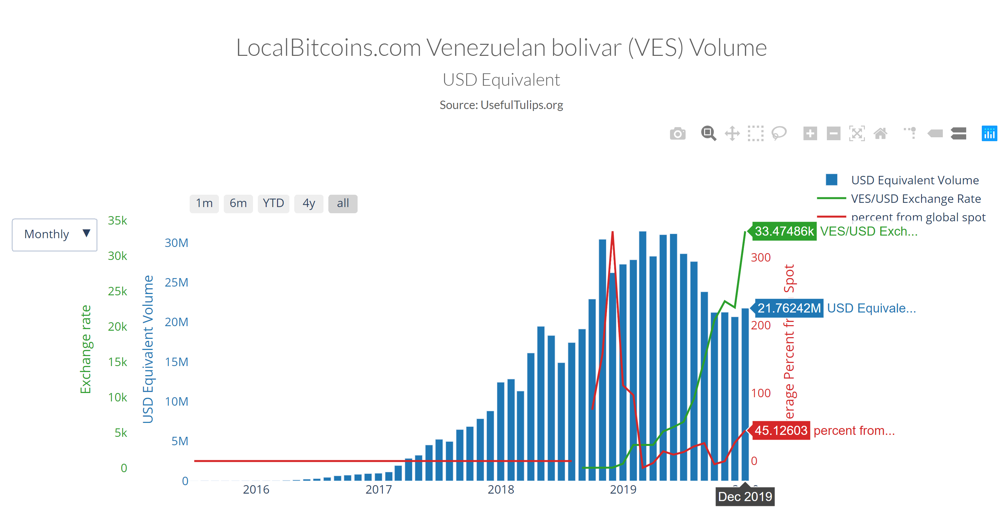
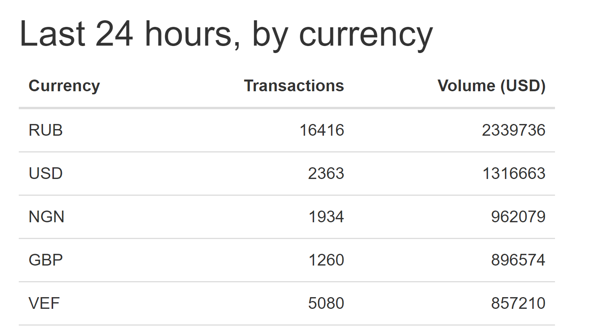

# apertus
A rhizomatic, sustainable and scalable community around decentralization with a first node in Caracas, Venezuela.

Caracas is one the crypto capitals of the world. Its transaction numbers and trade volume influence the entire Western Hemisphere. Yet, complexity determines the health of a civilization, and the abundance of miners and traders is sadly faced with a lack of startups, innovators and developers. We aim to change this by fostering a community around ETH. The pillars of the community are: Education (general and technical), Research, Public Policy, Ecosystem Development and Sustainability. It’ll be built to grow as a rhizome.

Before going deeper, let's first look at...

##  Data!

Source: https://www.usefultulips.org/VES_Page.html

Source consulted on 1/12/2020 for LocalBitcoins transaction and trading volume (USD): https://anacoinda.github.io/localbitcoins/all.html

Source: Taken from a presentation on Blockchain in LATAM made at Blockchain Summit Latam on the 25th of October 2019. Link to slides here: https://latamtech.la/docs/Resumen_1_Mapa_Blockchain_Latam.pdf

## Approach

On these lines, we won't focus on hard research to point out to the causes of this paradox (we don't have the capacity to do such research right now anyway) but will draw from personal experiences while focusing on solutions rather than on the problematic gap.

For example, rather than just pointing out that in the innovation map, two of the three companies mentioned are media outlets and the other an exchange, we can value that such media houses could amplify future innovations made in Venezuela. Just as well, we won't focus on describing the role of the Venezuelan government as a bad actor but rather the only good thing that has come from its medling into the space, the entire population of Venezuela (+30MM, less if you shave off population under a certain age, etc.) inside and outside the country have some degree of knowledge that digital currencies exists, maybe just the state issued faux-crypto Petro, but either way, in no other country the entire population has neither had such a degree of exposure to this technology or been directly or indirectly impacted by it.

Also, this is not a space to point out the myriad of crypto and blockchain related projects, mainly in the financial space, that have tried to enter the Venezuelan market, testing their apps, doing airdrops, or even fundraising to -mostly in an unverifiable way- provide help to the Venezuelan population with direct cash transfers and support to food programs. If it hasn't been perfect, inefficient or even questionable, we will focus on enabling a local community that may engage in correcting this and more, abiding by the same principles of decentralization, openness and transparency that are at the core of blockchain.

## Pillars of the Community

###### Education (General Public & Technical)

In 2019’s Global Talent Competitiveness Index, a report that evaluates the ability to enable, attract, grow, and retain talent, as well as form vocational, technical, and global knowledge skills, Latin, Central America and the Caribbean, is one of the three regions that don’t have countries ranking in the highest quartile of the index (i.e. top 30), being our top three countries, Chile (32nd), Costa Rica (34th) and Uruguay (46th). If we see it from the perspective of cities, Buenos Aires is the highest ranked at #77, falling from #35 last year.

**Venezuela & LATAM:** There's a need to generate better understanding about blockchain and cryptocurrency potential amongst the general public. Expose them to practical blockchain use and success cases, and hands-on experiences, that could impact their everyday lives, as well as demystifying cryptocurrencies usage, from just a means of financial speculation to another tool to make value exchange easier. To foster new opportunities for technical profiles to be exposed and trained in these technologies. There is a strong need to strengthen LATAM’s talent pipeline, not only regarding blockchain technology, but on other exponential/frontier technologies, and to promote the offer of quality education in these areas. Facilitating cross-sector partnerships, both local and global.

###### Research

Our plan is to launch two research projects alongside local (or even global) think-tanks that study governance and economics as partners. Research topics proposed include: blockchain-powered governance projects and how they could impact Venezuela, an in-depth mapping and documentation of the local ecosystem, a report (tied to the Public Policy area below) on the potential impact of blockchain technology in post-Maduro Venezuela exploring implementations like stable coins, DAOs, asset traceability, identity, voting, etc. Other topics may be considered. 

**Venezuela:** The goal of having a research unit upholds both providing ground for the use of blockchain in Venezuela and a knowledge base that may ease the soft-landing of global blockchain startups, initiatives and projects in the local ecosystem.

LATAM: There’s a need to promote the development of academic papers, open data and analytics that may benefit the sector, case studies, investigative journalism, thesis, and other research works. As well as promote networking and collaboration across universities and research centers.

###### Public Policy

LATAM has historically been perceived as a region where corruption thrives. As of 2018, [Transparency International’s Corruption Perceptions Index](https://www.transparency.org/cpi2018) only had one country in the top 25 non-corrupt, Uruguay at 23rd, with Chile coming close in 27th place. And Venezuela at number [168/180](https://www.transparency.org/country/VEN), ranking as the most corrupt nation state of the Americas. Higher level regional scandals like Odebrecht’s still loom over the region.

**Venezuela:** Producing the previously mentioned report on the potential impact of blockchain technology in post-Maduro Venezuela is key to influence the development of legal frameworks that support the use of technologies such as blockchain, as well as exposing key desicion-makers (i.e. policy-makers, technical advisors, trade association leaders, influential scholars and economists, etc.) to the opportunities posed by the technology. Ways to influence these key people beyond the report will be defined after mapping them and the creation of an overton window analysis.

LATAM: There’s a need to promote networking and collaboration amongst policymakers and legal professionals. Promote the use of blockchain across the public sector, public-private partnerships, and highlight private success cases. Promote civil participation in decision making use of these new means and leverage other technologies showcasing good practices.

###### Ecosystem Development

PwC’s Global Blockchain Survey 2018, explores the biggest barriers to blockchain adoption. The biggest being regulatory uncertainty (27%). But the next two, lack of trust among users (25%), ability to bring network together (21%), have been championed by the creation of global consortiums that foster interoperability and raise the potential scalability of a network’s success by bringing key stakeholders together. One could argue that this is also beneficial for regulatory concerns.

**Venezuela & LATAM:** As previously mentioned, there’s a need to Educate the general public, strengthen the talent pipeline, produce research and influence the legal framework to promote innovation. Nurture cross-sector collaboration, promoting the creation of consortiums, trade organizations, and cross-sector work groups. Create ongoing meeting spaces for the general public, innovators and industry specific players. Networking and partnerships must happen in collaboration with regional and global peers.

###### Sustainability

