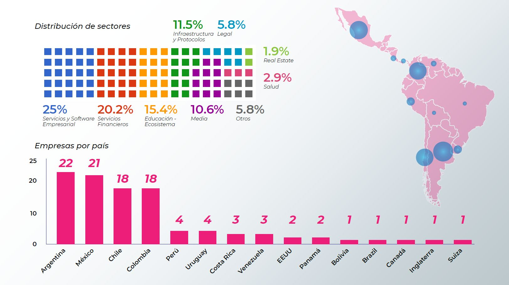

# apertus
A rhizomatic, sustainable and scalable community around decentralization with a first node in Caracas, Venezuela. 

Caracas is one the crypto capitals of the world. Its transaction numbers and trade volume influence the entire Western Hemisphere. Yet, complexity determines the health of a civilization, and the abundance of miners and traders is sadly faced with a lack of startups, innovators and developers using blockchain technology. We aim to change this by fostering a community around ETH.

In a first stage, the team will operate from a co-working space and engage the community in virtual and physical gatherings, it'll be composed of a director, project manager, designer, social media manager, developer advocate and a partner research team. The core pillars of the community are: Education (general and technical), Research, Decentralized Governance and Ecosystem Development, with a focus on Sustainability.

Before going deeper, let's first look at...

##  Blockchain across LATAM

Source: Taken from a presentation on Blockchain in LATAM made at Blockchain Summit Latam on the 25th of October 2019. Link to slides here: https://latamtech.la/docs/Resumen_1_Mapa_Blockchain_Latam.pdf

## Approach

On these lines, we will draw from personal experiences while focusing on solutions rather than on the problematic gap.

For example, rather than just pointing out that in the innovation map, two of the three companies mentioned are media outlets and the other an exchange, we can value that such media houses could amplify future innovations made in Venezuela. Just as well, we won't focus on describing the role of the Venezuelan government as a bad actor but rather the only good thing that has come from its medling into the space, the entire population of Venezuela (+30MM, less if you shave off citizens under a certain age, etc.) inside and outside the country have some degree of knowledge that digital currencies exists, maybe just the state issued faux-crypto Petro, but either way, in no other country the entire population has neither had such a degree of exposure to this technology or been directly or indirectly impacted by it.

This is a space that will focus on enabling a local community to level up the local ecosystem, from commodity based to innovation based, abiding by the same principles of decentralization, openness and transparency that are at the core of blockchain.

## Pillars of the Community

**Education (General Public & Technical)**

In 2019’s Global Talent Competitiveness Index, a report that evaluates the ability to enable, attract, grow, and retain talent, as well as form vocational, technical, and global knowledge skills, Latin, Central America and the Caribbean, is one of the three regions that don’t have countries ranking in the highest quartile of the index (i.e. top 30), being our top three countries, Chile (32nd), Costa Rica (34th) and Uruguay (46th). If we see it from the perspective of cities, Buenos Aires is the highest ranked at #77, falling from #35 last year.

There's a need to generate better understanding about blockchain and cryptocurrency potential amongst the general public. Expose them to practical blockchain use and success cases, and hands-on experiences, that could impact their everyday lives, as well as demystifying cryptocurrencies usage, from just a means of financial speculation to another tool to make value exchange easier. To foster new opportunities for technical profiles to be exposed and trained in these technologies. There is a strong need to strengthen LATAM’s talent pipeline, not only regarding blockchain technology, but on other exponential/frontier technologies, and to promote the offer of quality education in these areas. Facilitating cross-sector partnerships, both local and global.

**Research**

Our plan is to launch two research projects alongside local (or even global) think-tanks that study governance and economics as partners. Research topics proposed include: blockchain-powered governance projects and how they could impact Venezuela, an in-depth mapping and documentation of the local ecosystem, a report (tied to the Public Policy area below) on the potential impact of blockchain technology in post-Maduro Venezuela exploring implementations like stable coins, DAOs, asset traceability, identity, voting, etc. Other topics may be considered. 

The goal of having a research unit upholds both providing ground for the use of blockchain in Venezuela and a knowledge base that may ease the soft-landing of global blockchain startups, initiatives and projects in the local ecosystem.

There’s a need to promote the development of academic papers, open data and analytics that may benefit the sector, case studies, investigative journalism, thesis, and other research works. As well as promote collaboration across universities and research centers.

**Decentralized Governance**

LATAM has historically been perceived as a region where corruption thrives. As of 2018, [Transparency International’s Corruption Perceptions Index](https://www.transparency.org/cpi2018) only had one country in the top 25 non-corrupt, Uruguay at 23rd, with Chile coming close in 27th place. And Venezuela at number [168/180](https://www.transparency.org/country/VEN), ranking as the most corrupt nation state of the Americas. Higher level regional scandals like Odebrecht’s still loom over the region.

Producing the previously mentioned report on the potential impact of blockchain technology in post-Maduro Venezuela is key to influence the development of legal frameworks that support the use of technologies such as blockchain, as well as exposing key desicion-makers to the opportunities posed by the technology.

A less traditional but even more interesting approach to the team, is providing a bridge between blockchain-powered governance innovations and the grassroots civic movement in Venezuela. Our team has previously engaged and collaborated with leading platforms and groups working on DAOs, UBI, identity, digital jurisdictions, liquid democracy and quadratic voting.

On a personal note, our lead's passion project is the Synapsis.Network, a platform for a future of post-nations; fluid sovereign self-sustainable small hyper-connected collaborative communities.

**Ecosystem Development**

[Deloitte’s 2019 Global Blockchain Survey](https://www2.deloitte.com/us/en/insights/topics/understanding-blockchain-potential/global-blockchain-survey.html), explores the biggest barriers to blockchain adoption from a very corporate oriented report. The biggest being a tie between replacing or adapting legacy systems and regulatory issues (30%). The lack of in-house capabilities (skills and understanding) as one of the top barrier for adoption (28%) also comes up. Yet, the report highlights both the importance of consortiums and the top strategies to develop internal capabilities, being in-house courses, recruiting and online training.

As previously mentioned, there’s a need to educate the general public, strengthen the talent pipeline, produce research and influence the legal framework to promote innovation and nurture cross-sector collaboration, promoting the creation of working groups, consortiums and trade organizations. Create ongoing meeting spaces for the general public, innovators and industry specific players. And maintain open doors for regional and global partnerships.

## A Note on Sustainability and Scalability

The different pillars offer and overview of the potential and need for education, organization of events and production of research, activities that may be adapted as products and services to ensure the sustainability and scalability of the community to the region. A first draft of an organizational model built for regional replication can be found [here](https://docs.google.com/spreadsheets/d/19bEA18d2i58Wq5hiGf1TxWMaSwVzdQOymqRCCyQlNEM/edit#gid=0). Yet, the initial approach will be more traditional using a lean approach with set OKRs to test ideas while fine tuning the model during two quarters, leveraging assets like virtual gatherings and co-working space, and exploring a DAO model for future governance.
